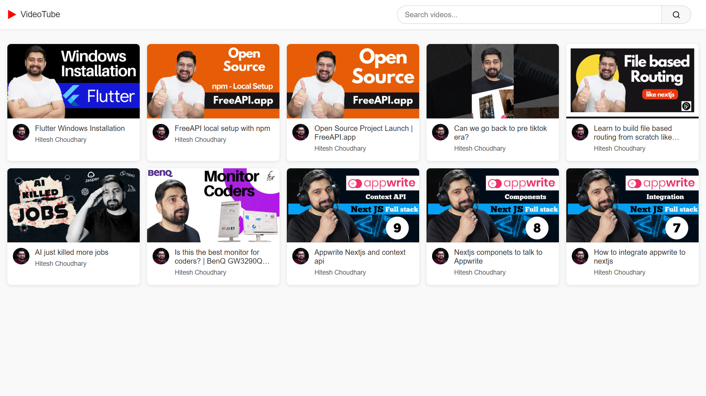

# 🎬 VideoTube - YouTube Style Video Listing

[](https://developer.mozilla.org/en-US/docs/Web/JavaScript)
[](https://developer.mozilla.org/en-US/docs/Web/HTML)
[](https://developer.mozilla.org/en-US/docs/Web/CSS)
[](https://freeapi.app)
[](https://www.youtube.com)

## 📝 Project Description

VideoTube is a responsive web application that mimics the basic functionality of YouTube's video listing interface. The application fetches video data from a public API and displays them in a clean, organized layout with thumbnails, titles, and channel information. Users can search for videos by title using a real-time search functionality.

## ✨ Features

- **Video Listing**: Clean display of video thumbnails with titles and channel information
- **Real-time Search**: Dynamic filtering of videos as you type
- **Responsive Design**: Adapts to different screen sizes
- **External API Integration**: Fetches video data from a public API
- **YouTube-style UI**: Familiar interface inspired by YouTube
- **Video Linking**: Clicking on thumbnails redirects to the actual YouTube video

## 🛠️ Technologies Used

- **HTML5**: Structure of the web application
- **CSS3**: Styling and responsive design
- **JavaScript**: Fetch API for data retrieval and DOM manipulation
- **External API**: Integration with freeapi.app's YouTube video endpoint

## 📋 Implementation Details

The application has several key components:

1. **API Integration**:
   - Fetches video data from the freeapi.app YouTube videos endpoint
   - Handles API responses and potential errors with try-catch blocks
   - Processes the returned JSON data to extract relevant video information

2. **Video Display**:
   - Dynamically creates video cards for each video in the API response
   - Displays thumbnails, video titles, and channel names
   - Includes clickable links to the original YouTube videos

3. **Search Functionality**:
   - Implements a real-time search feature that filters videos as you type
   - Uses regular expressions for case-insensitive search
   - Sanitizes user input to prevent regex errors
   - Dynamically updates the video listing based on search results

4. **User Interface**:
   - Clean, YouTube-inspired design with a recognizable layout
   - Responsive elements that adapt to different device sizes
   - Clear visual hierarchy for easy content scanning

## 🚀 How to Use

1. Open the application in a web browser
2. Browse through the list of videos displayed from the API
3. Use the search bar at the top to filter videos by title
4. Click on any video thumbnail to view the actual video on YouTube

## 🧩 Code Structure

- **HTML**: Defines the structure of the header, search bar, and video container
- **CSS**: Provides styling for the entire application, including responsive design
- **JavaScript**: Handles all functionality including:
  - API data fetching and processing
  - Dynamic creation of video cards
  - Real-time search filtering
  - Error handling

## 🔍 Search Implementation

The search functionality uses a regex-based approach for flexible matching:

```javascript
function filterVideos(searchInput) {
    const safePattern = searchInput.replace(/[.*+?^${}()|[\]\\]/g, "\\$&"); 
    const regex = new RegExp(safePattern, "i");
    return newData.filter((element) => regex.test(element.items.snippet.title));
}
```

Key features:
- **Input Sanitization**: Escapes special regex characters to prevent errors
- **Case Insensitivity**: Uses the `i` flag to match regardless of case
- **Real-time Updates**: Filters as the user types with keyup event listener

## 📈 Future Improvements

- Add pagination for handling larger sets of videos
- Implement video categories and filters
- Add user authentication for personalized video recommendations
- Create a detailed video view page with comments and related videos
- Implement dark mode and theme options
- Add video playback functionality within the application

## 📷 Screenshot



## 🔗 Live Demo

[View Live Demo](https://masterji-co-coding-challenges-uhju.vercel.app/)

## 📚 Repository

[GitHub Repository](https://github.com/your-username/videotube)

## ⚠️ API Note

This project uses the free YouTube videos API from freeapi.app. If the application displays no videos, it may be due to API rate limits or changes to the API structure.

---

<div align="center">
  
  <p>This project was completed as part of the Masterji.co platform challenge.</p>
</div>
